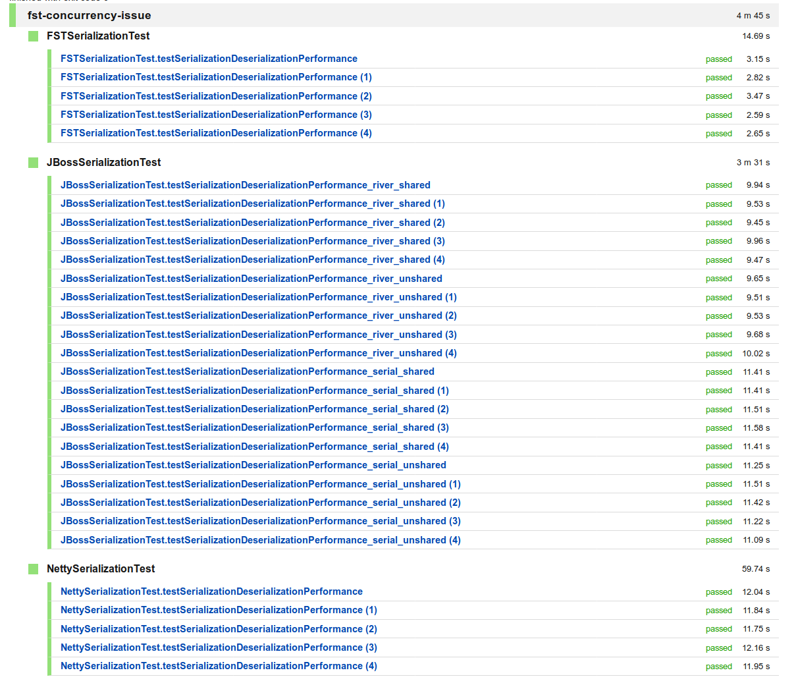

# serialization-performance-test

This repository tests the performance of the following serialization mechanisms:

- Netty's built-in ObjectEncoder/ObjectDecoder classes, which uses the JDK [ObjectOutputStream](https://docs.oracle.com/en/java/javase/11/docs/api/java.base/java/io/ObjectOutputStream.html)/[ObjectInputStream](https://docs.oracle.com/en/java/javase/11/docs/api/java.base/java/io/ObjectInputStream.html) mechanisms under the hood.
- [JBossSerialization](http://serialization.jboss.org/)
- [fast-serialization](https://github.com/RuedigerMoeller/fast-serialization) (fst)

## Result

The image below illustrates the relative performance between the different serialization libraries.

